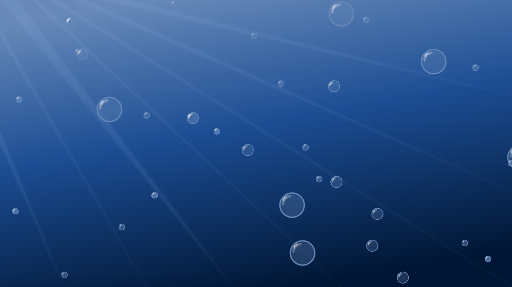

 
# Sea Background

## Description
The goal of this project was to create an infinitly running background that had bubbles animated to be rising from the bottom. Mostly to learn more about using and animating with canvas HTML. In the end there are three diffrent sized custom bubble pngs that follow a randomly selected route to the top from a choice of three. Shout out to Frank's Laboratory youtube channel for giving me the idea and teching me some of the techniques I used here! particularly these two videos: 

[How to Make your Games look Great](https://www.youtube.com/watch?v=jl29qI62XPg), 

[JavaSript 2D Game Tutorial](https://www.youtube.com/watch?v=jl29qI62XPg), [HTML5 Canvas Tutorial for Beginners](https://www.youtube.com/watch?v=ymmtEgp0Tuc&t=939s)
## Table of Contents
- #### [Description](##-description)
- #### [Installation](##-Installation)
- #### [Usage Information](##-usage-information)
- #### [License](##-license)
- #### [Contributing](##-contributing)
- #### [Questions](##-questions)

## Installation
You can install this package by cloning down the repository from github.
## Usage Information
Simply open it in browser.
## License
Copyright  2022  Kyle Costello
 
 Licensed under the Apache License, Version 2.0 (the "License");
 you may not use this file except in compliance with the License.
 You may obtain a copy of the License at
 
 http://www.apache.org/licenses/LICENSE-2.0
 
 Unless required by applicable law or agreed to in writing, software
 distributed under the License is distributed on an "AS IS" BASIS,
 WITHOUT WARRANTIES OR CONDITIONS OF ANY KIND, either express or implied.
 See the License for the specific language governing permissions and
 limitations under the License.
## Contributing
If you have any contribution ideas, please contact me, my info is in  the questions section at the bottom.

## Questions
If you have any questions regarding this project please feel free to reach out at 

-Email: kylec0217@gmail.com 
-GitHub Username: krestle80 